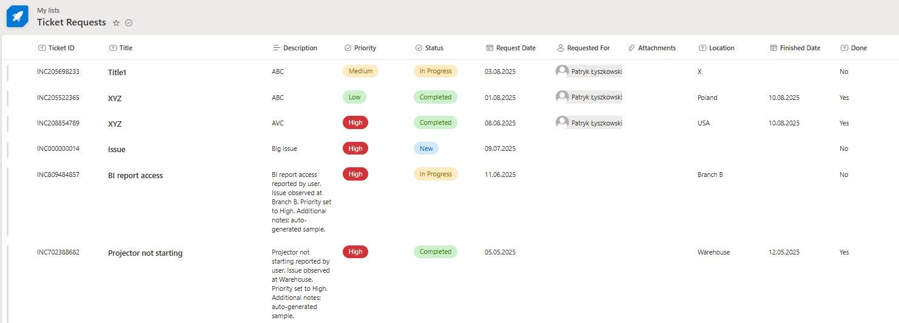
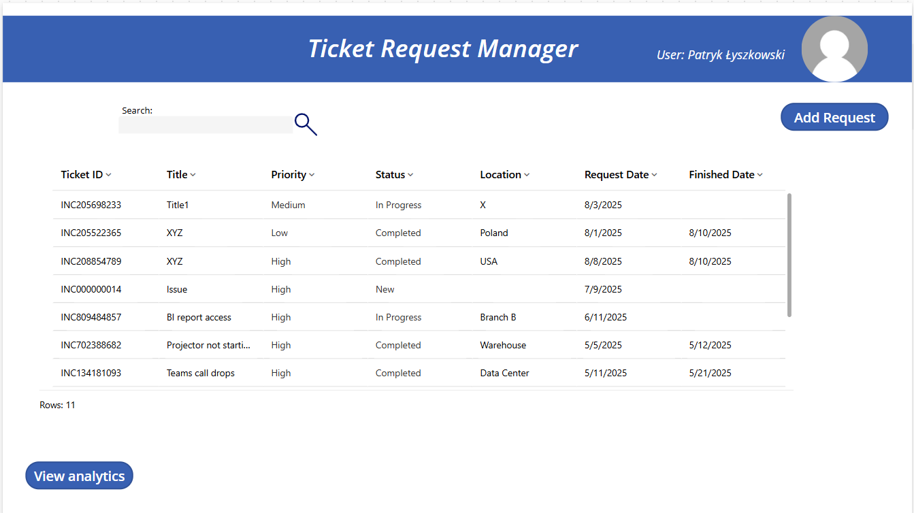
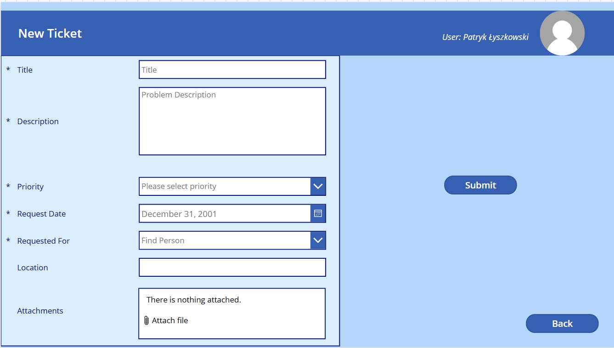
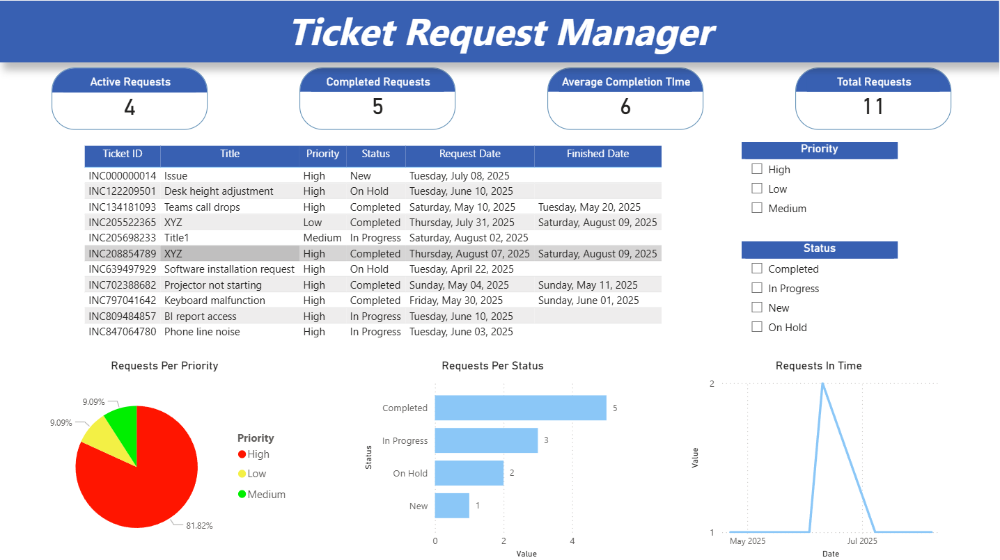
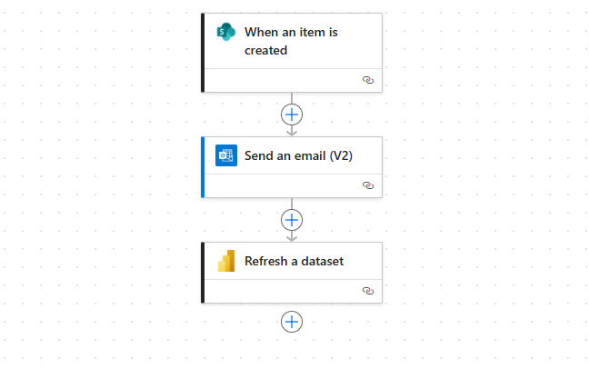
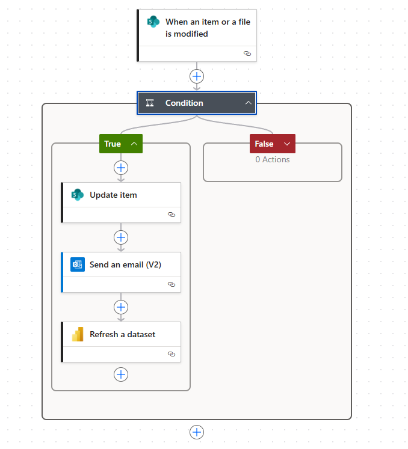

# 🎫 Ticket Request Manager

## 🇬🇧 English

### 📌 Project Overview
Ticket Request Manager is a solution built on Microsoft Power Platform to simplify ticket submission, tracking, and management within a company.  
The project integrates **Power Apps**, **SharePoint**, **Power Automate**, and **Power BI** into one cohesive system that removes email chaos, automates notifications, and provides real-time insights.

### 🚀 Key Features
- Power Apps ticket form with automatic Ticket ID generation.
- Dashboard for viewing own tickets (search & filter functionality).
- Automatic setting of Finished Date when status changes to *Completed*.
- Email notifications for the requester.
- Power BI KPI dashboard with real-time statistics.

### 🛠 Technology Stack
- **Power Apps** – user interface.
- **SharePoint** – main data source.
- **Power Automate** – automation of notifications and updates.
- **Power BI** – reporting and data visualization.

### 📊 Power BI Report Highlights
- Total number of tickets.
- Completed tickets.
- Active tickets.
- Average completion time (days).
- Status, priority, and trend charts.

### 🔜 Future Enhancements
- Login screen with roles (Admin/User).
- "Assigned To" column to assign tickets to specific team members.
- Ticket editing restrictions based on status.
- Change history & comments.
- Dataverse version for scalability.
- AI integration for ticket categorization.

---

## 🇵🇱 Polski

### 📌 Opis projektu
Ticket Request Manager to aplikacja stworzona w ramach Microsoft Power Platform, która ułatwia zgłaszanie, śledzenie i obsługę ticketów w firmie.  
Projekt łączy **Power Apps**, **SharePoint**, **Power Automate** i **Power BI** w jedno spójne rozwiązanie, eliminując chaos mailowy, automatyzując powiadomienia i dostarczając wgląd w dane w czasie rzeczywistym.

### 🚀 Funkcjonalności
- Formularz zgłoszeń w Power Apps z automatycznym nadawaniem Ticket ID.
- Dashboard z listą własnych zgłoszeń (wyszukiwarka + filtry).
- Automatyczne ustawienie daty zakończenia przy statusie *Completed*.
- Wysyłanie powiadomień e-mail do zgłaszającego.
- Dashboard KPI w Power BI z bieżącymi statystykami.

### 🛠 Technologie
- **Power Apps** – interfejs użytkownika.
- **SharePoint** – główne źródło danych.
- **Power Automate** – automatyzacja powiadomień i aktualizacji.
- **Power BI** – raportowanie i wizualizacja danych.

### 📊 Raport Power BI zawiera
- Liczbę wszystkich zgłoszeń.
- Liczbę zgłoszeń zakończonych.
- Liczbę zgłoszeń w toku.
- Średni czas realizacji (dni).
- Wykresy statusów, priorytetów i trendów.

### 🔜 Możliwości rozbudowy
- Ekran logowania i role użytkowników (Admin/User).
- Kolumna „Assigned To” do przypisywania zgłoszeń.
- Ograniczenia edycji zgłoszenia w zależności od statusu.
- Historia zmian i komentarze.
- Wersja oparta na Dataverse.
- Integracja AI do kategoryzacji zgłoszeń.

## Screenshots

### SharePoint List

### Power Apps - Main Screen

### Power Apps - Form

### Power BI - KPI Report

### Power Automate - New Request Flow

### Power Automate - Completed Flow

